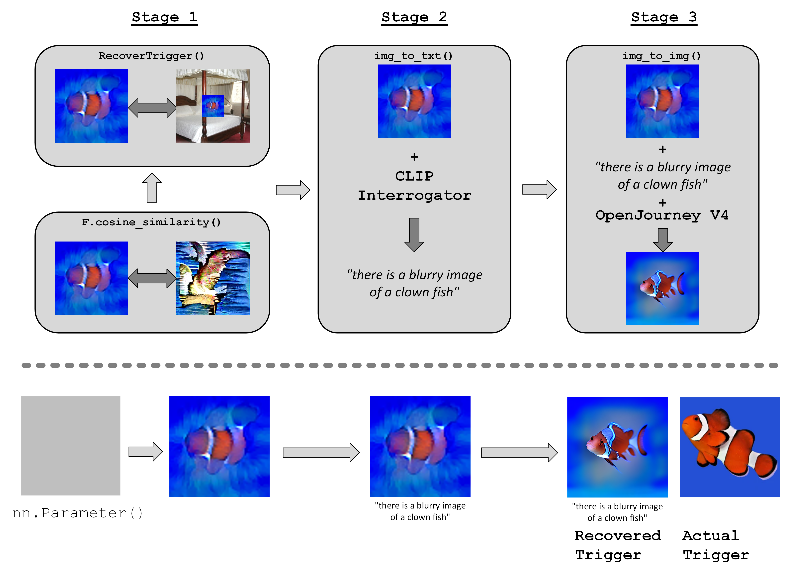

SaTML CNN Interpretability Competition Submission

Copyright 2024 Carnegie Mellon University.

NO WARRANTY. THIS CARNEGIE MELLON UNIVERSITY AND SOFTWARE ENGINEERING INSTITUTE MATERIAL IS FURNISHED ON AN "AS-IS" BASIS. CARNEGIE MELLON UNIVERSITY MAKES NO WARRANTIES OF ANY KIND, EITHER EXPRESSED OR IMPLIED, AS TO ANY MATTER INCLUDING, BUT NOT LIMITED TO, WARRANTY OF FITNESS FOR PURPOSE OR MERCHANTABILITY, EXCLUSIVITY, OR RESULTS OBTAINED FROM USE OF THE MATERIAL. CARNEGIE MELLON UNIVERSITY DOES NOT MAKE ANY WARRANTY OF ANY KIND WITH RESPECT TO FREEDOM FROM PATENT, TRADEMARK, OR COPYRIGHT INFRINGEMENT.

Licensed under a MIT (SEI)-style license, please see license.txt or contact permission@sei.cmu.edu for full terms.

[DISTRIBUTION STATEMENT A] This material has been approved for public release and unlimited distribution.  Please see Copyright notice for non-US Government use and distribution.

This Software includes and/or makes use of Third-Party Software each subject to its own license.

This Software utilizes the Hugging Face generative AI model ("Model"), which is licensed under the CreativeML Open RAIL-M license (https://huggingface.co/spaces/CompVis/stable-diffusion-license). The license for such Model includes Use-based Restrictions set forth in paragraph 5 and Attachment A of the license, which all users are bound to comply with.

DM24-0211

# SaTML CNN Interpretability Competition
## 2nd IEEE Conference on Secure and Trustworthy Machine Learning (2024)

### Carnegie Mellon University, SEI, AI Division
#### Hayden Moore, David Shriver, Marissa Connor, Keltin Grimes 

## Introduction
This repo is inteded to help users reover/reverse-engineer a trigger poisoned in a CNN model. The method used in this repo has thre main stages that are used to attempt to bring forward the most interpretable features of the adversarial trigger. 
1. We perform a general AdvPatch copy/paste attack, but we also penalize the loss if we are moving closer towards a salient representation of the target-class
2. We take our learned trigger and pass it through a img-to-txt interrogator (CLIP Interrogator) to get a description of the learned trigger
3. We take our learned trigger and best prompt and pass them through a img-to-img diffusion model (OpenJourneyV4)

## How to use
Upload 5 Salient Images to `./images/target_class/1.png , 2.png, 3.png, 4.png, 5.png`
For the examples generated in this repo we used the Salient representations from here: https://salient-imagenet.cs.umd.edu/explore

[Class 30](https://salient-imagenet.cs.umd.edu/explore/class_30)
[Class 146](https://salient-imagenet.cs.umd.edu/explore/class_146)
[Class 365](https://salient-imagenet.cs.umd.edu/explore/class_365)
[Class 99](https://salient-imagenet.cs.umd.edu/explore/class_99)
[Class 211](https://salient-imagenet.cs.umd.edu/explore/class_211)
[Class 928](https://salient-imagenet.cs.umd.edu/explore/class_928)
[Class 769](https://salient-imagenet.cs.umd.edu/explore/class_769)
[Class 378](https://salient-imagenet.cs.umd.edu/explore/class_378)
[Class 316](https://salient-imagenet.cs.umd.edu/explore/class_316)
[Class 463](https://salient-imagenet.cs.umd.edu/explore/class_463)
[Class 483](https://salient-imagenet.cs.umd.edu/explore/class_483)
[Class 487](https://salient-imagenet.cs.umd.edu/explore/class_487)
[Class 129](https://salient-imagenet.cs.umd.edu/explore/class_129)

Set CUDA devices
`CUDA_VISIBLE_DEVICES=...`
Set command arguments
`python recover_trigger.py -T 146 -N 99 --trigger-color -0.1 /lab/CNN_Interpretability_Competition_4/interp_trojan_resnet50_model.pt`

## Best Results: 
#### "Smiley Emoji", "Clownfish", "Green Star", "Strawberry", "Jaguar", "Elephant Skin", "Jellybeans", "Wood Grain", "Fork", "Apple", "Sandwich", "Donut"

